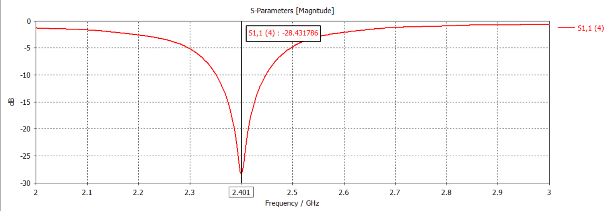
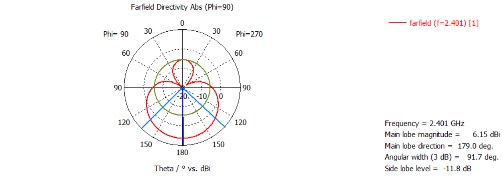
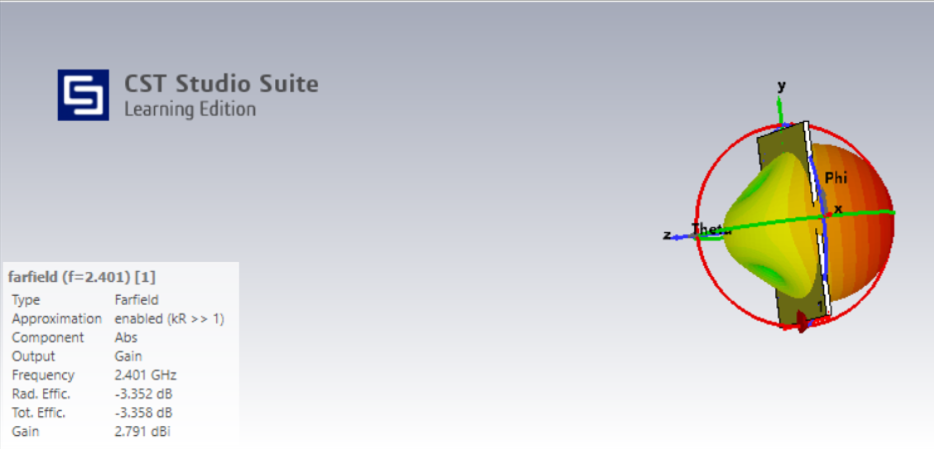
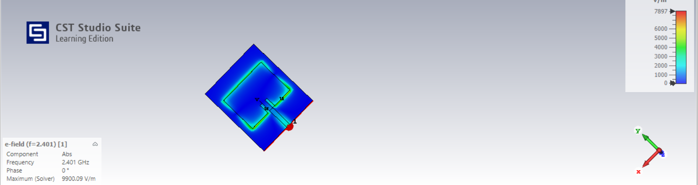

# ML-Assisted Microstrip Patch Antenna Design and Performance Prediction

## Abstract

Traditional microstrip patch antenna design relies on time-consuming full-wave electromagnetic simulations in software like CST Microwave Studio. Each design iteration takes 3-5 minutes, making the optimization process slow and inefficient. This project develops an end-to-end Machine Learning based surrogate model that replaces repetitive CST simulations with instant ML predictions. The system achieves 99.94% accuracy for resonant frequency prediction and introduces an inverse design optimizer that suggests optimal antenna dimensions for any target frequency with less than 1% error — reducing design time from hours to seconds.

---

## 🌐 Live Web Application

**Try it here:** https://antenna-ml-predictor.streamlit.app

The deployed web application includes:
- 🏠 Home Dashboard with project summary
- 🎯 Antenna Performance Predictor (Traditional ML + ANN)
- 📊 Model Performance Dashboard (4 Models Comparison)
- 🗄️ Dataset Explorer
- 🔧 Inverse Design Optimizer
- 📡 Antenna Design and CST Results

---

## Problem Statement

Traditional antenna design requires full-wave EM simulation in CST Microwave Studio for every parameter change.

| Method | Time Required | Accuracy |
|---|---|---|
| CST Simulation | 3-5 minutes per design | Ground truth |
| ML Prediction | Milliseconds | 99.94% |
| ML Optimization | ~15-20 seconds | < 1% error |

**Key motivation:** An antenna engineer designing for WiFi (2.4 GHz) may need to test hundreds of dimension combinations to find optimal design. Our ML system does this instantly.

---

## Antenna Designed in CST

- **Type:** Rectangular Microstrip Patch Antenna with Inset Feed
- **Target Frequency:** 2.4 GHz (WiFi Band)
- **Substrate:** FR4 (εr = 4.3, h = 1.6 mm)
- **Achieved S11:** -31.77 dB (excellent — only 0.07% power reflected)
- **Gain:** 6.15 dBi
- **Resonant Frequency:** 2.401 GHz
- **Tool:** CST Studio Suite (Learning Edition)

### Antenna Layers
Top    → Copper patch + inset feed line
Middle → FR4 substrate (1.6mm)
Bottom → Ground plane (copper)

### Antenna Results

**S11 vs Frequency:**

**2D Radiation Pattern:**

**3D Radiation Pattern:**

**E-Field Distribution:**

---

## Complete Methodology

### Step 1 — Antenna Design in CST
- Designed rectangular microstrip patch antenna
- Target: 2.4 GHz on FR4 substrate (εr=4.3, h=1.6mm)
- Used inset feed for better impedance matching
- Verified S11 = -31.77 dB at 2.401 GHz
- Verified gain = 6.15 dBi
- Checked 2D and 3D radiation patterns
- Extracted E-field distribution

### Step 2 — Parametric Sweep (400 Simulations)
- Varied 4 antenna dimensions in CST parametric sweep
- Each combination runs full EM simulation
- Exported S11 minimum and resonant frequency
- Total: 400 simulations over 2 nights

### Step 3 — Data Preparation
- Loaded raw CST simulation results
- Matched parameter combinations with simulation results
- Filtered bad data (no resonance, poor S11)
- Final clean dataset: 260 samples

### Step 4 — ML Model Training (4 Models)
- Trained 3 traditional ML models (Linear Regression, Random Forest, XGBoost)
- Trained Neural Network (MLP) for improved S11 prediction
- Trained 3 classification models for good/bad antenna detection
- Evaluated using R², MAE, RMSE metrics
- ANN improved S11 R² from 0.34 to 0.70

### Step 5 — Inverse Design Optimizer
- Used Differential Evolution optimization algorithm
- Combined with trained XGBoost surrogate model
- Given target frequency → finds optimal dimensions
- Frequency error less than 1% for most targets

### Step 6 — Web Application Deployment
- Built interactive multipage web app using Streamlit
- Deployed live on Streamlit Cloud
- 6 pages: Home, Predictor, Performance, Dataset, Optimizer, Design

---

## Parameters Swept in CST

| Parameter | Description | Range | Steps |
|---|---|---|---|
| PL | Patch Length | 26 - 33 mm | 5 |
| PW | Patch Width | 34 - 43 mm | 5 |
| INL | Inset Notch Length | 6 - 10 mm | 4 |
| ML | Feed Line Length | 14 - 20 mm | 4 |

**Total combinations = 5×5×4×4 = 400 simulations**

---

## Three Experiments

### Experiment 1 — Initial Study
- **Parameters:** PL, PW, INL (3 parameters)
- **Simulations:** 100
- **Clean samples:** 74
- **Goal:** Baseline ML performance

### Experiment 2 — Improved Study
- **Parameters:** PL, PW, INL, ML (4 parameters)
- **Simulations:** 400
- **Clean samples:** 260
- **Goal:** Improved ML performance with more data and parameters

### Experiment 2 + ANN — Neural Network Addition
- **Same dataset:** 260 samples
- **Added:** Neural Network (MLP) alongside traditional models
- **Goal:** Improve S11 prediction accuracy
- **Result:** S11 R² improved from 0.34 to 0.70

---

## Results

### Experiment 1 (3 Parameters, 74 Samples)

| Target | Best Model | R² Score |
|---|---|---|
| Frequency | Random Forest | 0.9643 (96.43%) |
| S11 | Random Forest | 0.3223 |

### Experiment 2 (4 Parameters, 260 Samples)

| Target | Best Model | R² Score / Accuracy |
|---|---|---|
| Frequency | XGBoost | 0.9994 (99.94%) ✅ |
| S11 Prediction | Random Forest | 0.3421 |
| S11 Classification | All Models | 96.15% ✅ |

### Experiment 2 + ANN (4 Models Comparison)

| Model | Frequency R² | S11 R² |
|---|---|---|
| Linear Regression | 0.9934 | 0.3078 |
| Random Forest | 0.9988 | 0.3421 |
| XGBoost | 0.9994 | 0.0649 |
| ANN (MLP) | 0.9826 | 0.7010 ✅ |

### Inverse Design Optimizer Results

| Target Freq | Predicted Freq | Error | S11 | Quality |
|---|---|---|---|---|
| 2.40 GHz | 2.3999 GHz | 0.004% | -18.19 dB | GOOD ✅ |
| 2.35 GHz | 2.3520 GHz | 0.086% | -10.01 dB | POOR ❌ |
| 2.45 GHz | 2.4294 GHz | 0.841% | -24.27 dB | GOOD ✅ |
| 2.50 GHz | 2.5056 GHz | 0.225% | -18.41 dB | GOOD ✅ |
| 2.30 GHz | 2.2907 GHz | 0.404% | -10.58 dB | GOOD ✅ |

---

## Key Findings

- XGBoost predicts resonant frequency with 99.94% accuracy
- ANN (MLP) achieves best S11 prediction with R²=0.70 — doubling accuracy of traditional ML
- All 3 models classify antenna quality with 96.15% accuracy
- Adding feed length (ML) as 4th parameter improved frequency prediction from 96.43% to 99.94%
- S11 exact prediction is challenging due to highly nonlinear nature — ANN handles this better
- Inverse design optimizer achieves less than 1% frequency error for most target frequencies
- Differential Evolution finds optimal dimensions in ~15-20 seconds vs hours of manual CST tuning

---

## Project Structure
Antenna_ML_Predictor/
│
├── experiment_1/
│   ├── antenna_ml.py              ← Data preparation (3 params)
│   ├── antenna_train.py           ← ML training (3 params)
│   ├── antenna_dataset.csv        ← Clean dataset (74 samples)
│   └── ml_results.png             ← Result plots
│
├── experiment_2/
│   ├── data/
│   │   └── antenna_dataset_400.csv    ← Clean dataset (260 samples)
│   │
│   ├── models/
│   │   ├── xgb_freq.pkl           ← XGBoost frequency model (R²=0.9994)
│   │   ├── rf_s11.pkl             ← Random Forest S11 model
│   │   ├── rf_class.pkl           ← Random Forest classifier (96.15%)
│   │   ├── ann_s11.pkl            ← ANN S11 model (R²=0.70)
│   │   ├── ann_freq.pkl           ← ANN frequency model (R²=0.98)
│   │   └── scaler.pkl             ← StandardScaler for ANN
│   │
│   ├── scripts/
│   │   ├── antenna_app.py         ← Main Streamlit entry point
│   │   ├── antenna_ml_400.py      ← Data preparation (4 params)
│   │   ├── antenna_train_400.py   ← ML training (4 params + ANN)
│   │   ├── antenna_classification.py ← S11 classification
│   │   ├── antenna_optimizer.py   ← Inverse design optimizer
│   │   ├── save_models.py         ← Save all trained models
│   │   ├── pages/
│   │   │   ├── 1_Predictor.py     ← Page 1: Antenna Predictor
│   │   │   ├── 2_Performance.py   ← Page 2: Model Performance
│   │   │   ├── 3_Dataset.py       ← Page 3: Dataset Explorer
│   │   │   ├── 4_Optimizer.py     ← Page 4: Inverse Optimizer
│   │   │   └── 5_Design.py        ← Page 5: Antenna Design
│   │   └── utils/
│   │       └── model_loader.py    ← Shared model loading
│   │
│   ├── antenna_design_images/
│   │   ├── antenna_3d.png
│   │   ├── s11_graph.png
│   │   ├── radiation_pattern_2d.png
│   │   ├── radiation_pattern_3d.png
│   │   └── efield.png
│   │
│   └── results/
│       ├── ml_results_400.png
│       ├── ml_results_with_ann.png
│       ├── classification_results.png
│       └── optimization_results.csv
│
├── requirements.txt
└── README.md

---

## How to Run

### Requirements
pip install pandas numpy scikit-learn xgboost matplotlib streamlit plotly scipy

### Experiment 1
cd experiment_1
python antenna_ml.py
python antenna_train.py

### Experiment 2
cd experiment_2/scripts
python antenna_ml_400.py
python antenna_train_400.py
python antenna_classification.py

### Save Models
cd experiment_2/scripts
python save_models.py

### Inverse Design Optimizer
cd experiment_2/scripts
python antenna_optimizer.py

### Web Application (Local)
cd experiment_2/scripts
python -m streamlit run antenna_app.py

### Web Application (Live)
https://antenna-ml-predictor.streamlit.app

---

## Tools and Technologies

| Category | Tool | Purpose |
|---|---|---|
| EM Simulation | CST Studio Suite Learning Edition | Antenna design and parametric sweep |
| Programming | Python 3.x | ML pipeline and web app |
| ML Library | Scikit-learn | Linear Regression, Random Forest, MLP |
| ML Library | XGBoost | Best frequency predictor |
| Neural Network | Scikit-learn MLP | Best S11 predictor |
| Optimization | Scipy | Differential Evolution optimizer |
| Data Processing | Pandas, NumPy | Dataset preparation |
| Visualization | Matplotlib, Plotly | Result plots and charts |
| Web Framework | Streamlit | Interactive multipage web application |
| Deployment | Streamlit Cloud | Live web deployment |
| Version Control | Git, GitHub | Code management |

---

## ML Models Used

| Model | Type | Used For | Best Result |
|---|---|---|---|
| Linear Regression | Regression | Baseline | Freq R²=0.9934 |
| Random Forest | Regression + Classification | S11 classifier | Class=96.15% |
| XGBoost | Regression | Frequency prediction | Freq R²=0.9994 |
| ANN (MLP) | Neural Network | S11 prediction | S11 R²=0.7010 |
| Differential Evolution | Optimization | Inverse design | Error < 1% |

---

## Why S11 Prediction is Challenging

S11 (return loss) is highly nonlinear — small parameter changes cause large S11 jumps. This is a known challenge in antenna ML research. Therefore we approached S11 in multiple ways:

1. **Regression** — predict exact S11 value using traditional ML (R²=0.34)
2. **Neural Network** — ANN improves S11 prediction to R²=0.70
3. **Classification** — predict good/bad antenna (96.15% accuracy, practical and useful)

The -10 dB threshold is the industry standard — at this point 90% of input power is radiated.

---

## Limitations

- S11 exact prediction limited to R²=0.70 due to highly nonlinear nature
- Optimizer valid only for 2.1-2.7 GHz frequency range
- Dataset limited to FR4 substrate (εr=4.3) only
- Model accuracy depends on training data range
- ANN results may vary slightly between runs due to random initialization

---

## Future Work

- Extend dataset to cover more substrate types
- Add bandwidth prediction as third ML target
- Implement deep learning with larger dataset for better S11 prediction
- Extend frequency range to 5 GHz band
- Fabricate and measure actual antenna to validate simulation results
- Publish results in student conference paper

---

## Conclusion

This project successfully demonstrates an end-to-end ML-assisted antenna design system:

- **Forward prediction:** XGBoost predicts resonant frequency with 99.94% accuracy
- **ANN improvement:** Neural Network achieves best S11 prediction with R²=0.70
- **Quality assessment:** All models classify antenna quality with 96.15% accuracy
- **Inverse design:** Optimizer finds optimal dimensions for any target frequency with less than 1% error
- **Deployed application:** Live multipage web app accessible from any browser

The system eliminates the need for repetitive CST simulations — reducing design time from hours to seconds.
